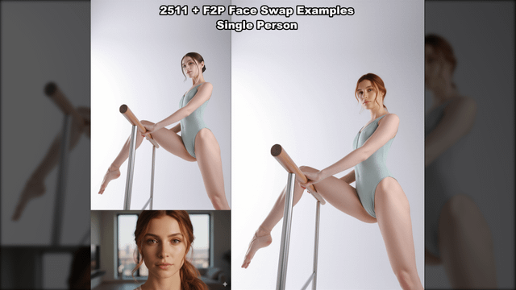
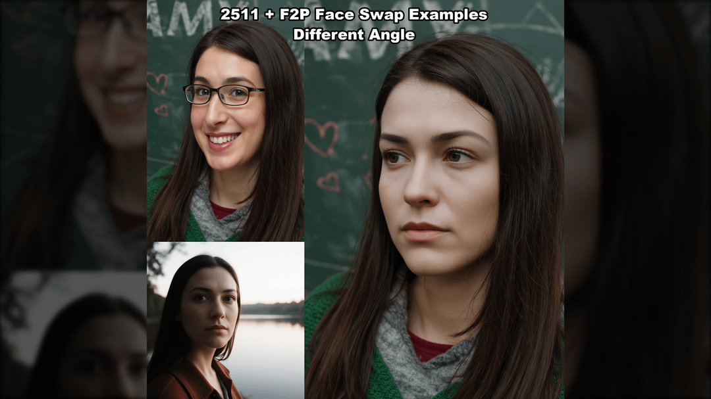
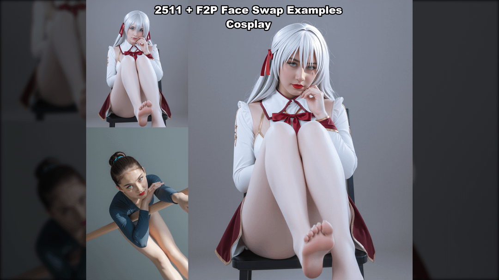
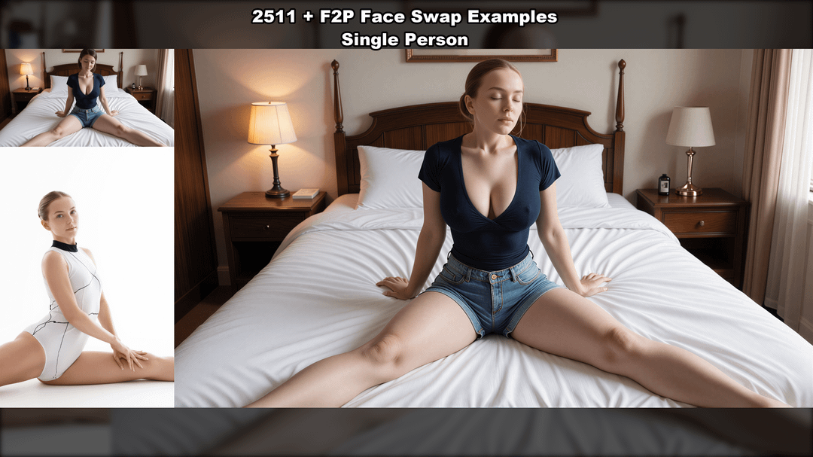
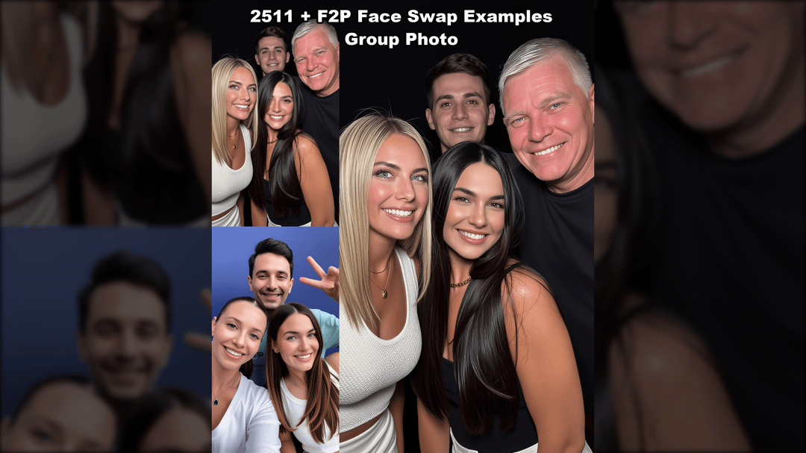
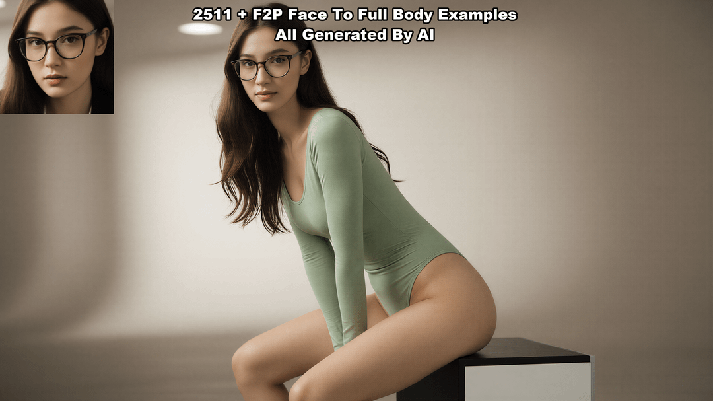

# Qwen Image Edit 2511 - Face Swap Guide

## Übersicht

Qwen-Image-Edit-2511 ist ein verbessertes Bildbearbeitungsmodell mit:
- Verbesserte Charakterkonsistenz
- Multi-Personen-Bearbeitung
- Integrierte LoRA-Fähigkeiten
- Verstärkte geometrische Reasoning-Fähigkeiten
- Bessere Expression-Transfer und verschiedene Gesichtswinkel beim Face Swap

> **Hinweis:** Nach dem Update auf 2511 sind Dinge möglich, die mit 2509 nicht funktionierten - wie Expression-Transfer und verschiedene Gesichtswinkel. Die Prompt-Adherence ist jetzt stärker.

### Beispiel: 2511 + F2P Face Swap (Single Person)


*Links: Original + Quellgesicht | Rechts: Ergebnis nach Face Swap mit Qwen 2511 + F2P LoRA*



*Weiteres Beispiel mit verschiedenen Gesichtswinkeln*



*Multi-Person Face Swap Beispiel*



*Expression Transfer Beispiel*



*Face to Full Body Beispiel*



*Weiteres Face Swap Beispiel*



*Angle Variation Beispiel*

---

## Ressourcen

| Ressource | Link |
|-----------|------|
| **Video Tutorial** | https://youtu.be/_QYBgeII9Pg |
| **Workflow (Face Swap)** | https://www.runninghub.ai/post/1985156515172667394 |
| **Workflow (Face to Full Body)** | https://www.runninghub.ai/post/2005959008957726722 |
| **F2P LoRA (ModelScope)** | https://modelscope.cn/models/DiffSynth-Studio/Qwen-Image-Edit-F2P |
| **Rapid-AIO Model** | https://huggingface.co/Phr00t/Qwen-Image-Edit-Rapid-AIO |
| **Hugging Face Space** | https://huggingface.co/spaces/Qwen/Qwen-Image-Edit-2511 |
| **GGUF Modelle** | https://huggingface.co/unsloth/Qwen-Image-Edit-2511-GGUF |
| **Tutorial Creator** | FaboroHacks (YouTube/Bilibili) |

---

## Installation

### Voraussetzungen
- **ComfyUI**: Neueste Nightly Build verwenden!
- **VRAM**:
  - 12GB Minimum (mit GGUF Quantisierung)
  - 24GB komfortabel (FP8)
  - 40GB+ für Full Precision

### Model Downloads (aus Video-Tutorial)

```
ComfyUI/models/
├── diffusion_models/
│   └── qwen_image_edit_2511_fp8mixed.safetensors
├── unet/
│   └── qwen-image-edit-2511-Q4_0.gguf          # GGUF für Low VRAM
├── text_encoders/
│   └── qwen_2.5_vl_7b_fp8_scaled.safetensors
├── vae/
│   └── qwen_image_vae.safetensors
└── loras/
    ├── Qwen-Image-Edit-2511-Lightning-4steps-V1.0.safetensors
    ├── consistency_edit_v2.safetensors
    └── Qwen-Image-Edit-F2P.safetensors         # F2P LoRA!
```

### LoRA Strength Einstellungen (aus Workflow)

| LoRA | Strength |
|------|----------|
| Lightning-4steps-V1.0 | 1.00 |
| consistency_edit_v2 | 0.75 |
| **Qwen-Image-Edit-F2P** | **0.80** |

---

## F2P LoRA Versionen (Phr00t/Qwen-Image-Edit-Rapid-AIO)

| Version | Beschreibung | Empfohlener Scheduler |
|---------|--------------|----------------------|
| V14 | Trimmed LoRAs, reduziert "plastic look" | er_sde/beta |
| V14.1 | Added "InSubject" LORA für Character Consistency | er_sde/beta |
| V15 | Jetzt mit Qwen-Edit-2511, leichte LoRA Anpassungen | er_sde/beta |
| V16 | Slimmed down, weitere NSFW LoRA Tweaks | er_sde/beta |
| V17 | Merged 2509+2511 für Kontrast und Kompatibilität | **euler_ancestral/beta** |
| V18 | Mehr 2511, weniger 2509, fixes für multi-input | **euler_ancestral/beta** |

---

## KSampler Einstellungen

| Variante | CFG | Steps | Scheduler |
|----------|-----|-------|-----------|
| BF16 | 4.0 | 40 | kl_optimal |
| FP8 | 4.0 | 20 | kl_optimal |
| FP8 + Lightning LoRA | 1.0 | 4 | - |
| V17/V18 Rapid-AIO | 4.0 | 20 | euler_ancestral/beta |

---

## High Fidelity Face Swap Workflow

### Workflow Name: "High Fidelity Face Swap With Qwen Image Edit F2P_dev2511"

### Step 1: Load Models
- **GGUFLoaderKJ**: `qwen-image-edit-2511-Q4_0.gguf`
- **Load Diffusion Model**: `qwen_image_edit_2511_fp8mixed.safetensors`
- **LoraLoaderModelOnly** (3x):
  - Lightning-4steps (strength: 1.00)
  - consistency_edit_v2 (strength: 0.75)
  - F2P (strength: 0.80)
- **Load CLIP**: `qwen_2.5_vl_7b_fp8_scaled.safetensors`
- **Load VAE**: `qwen_image_vae.safetensors`

### Step 2: Load Input Images
- **Load Image main body**: Das Zielbild (Körper)
- **Load Image face**: Das Quellgesicht

### Step 3: Prompt
- **QwenVL Node**:
  - model_name: `Qwen2-VL-4B-Instruct`
  - detailed_prompt: "Detailed Description"
  - max_tokens: 512

> **WICHTIG:** "The prompt matters a lot over the final result. Be careful with it."

---

## Wichtige Nodes und Einstellungen

### Image Processing

| Node | Einstellung | Wert |
|------|-------------|------|
| **LayerUtility: ImageScaleByAspectRatio** | target_size | 1536 |
| | upscale_method | lanczos |
| | crop_method | center |

### Masking

| Node | Einstellung | Wert |
|------|-------------|------|
| **LayerMask: MaskGrow** | grow | 30 |
| | blur | 20 |
| **LayerMask: Human Parts Ultra(Advanced)** | face | enabled |
| | hair | enabled |
| | glasses | disabled |
| | top_clothes | disabled |
| | bottom_clothes | disabled |

### Face Detection

| Node | Einstellung | Wert |
|------|-------------|------|
| **Auto Crop Faces** | number_of_faces | 5 |
| | scale_factor | 4.0 |
| | shift_factor | 0.45 |

---

## Expression Transfer Workflow

Der Workflow enthält einen separaten Bereich für **Expression Transfer**:
- Ermöglicht das Übertragen von Gesichtsausdrücken
- Funktioniert mit verschiedenen Gesichtswinkeln
- Toggle: "Enable Expression transfer" (yes/no)

---

## Face to Full Body Workflow

Separater Workflow für das Generieren eines vollständigen Körpers aus einem Gesichtsbild:
- Workflow auf RunningHub verfügbar
- Verwendet zusätzlich: **Load Image Pose** für Körperpose
- Output Size kann sehr hoch sein (z.B. 2700x4300)

---

## Tipps für beste Ergebnisse

1. **Hochauflösende Quellbilder** verwenden
2. **Ähnliche Beleuchtung** in beiden Bildern hilft
3. **Prompt sorgfältig formulieren** - hat großen Einfluss auf das Ergebnis
4. **F2P LoRA Strength bei 0.80** - nicht zu hoch, sonst "plastischer" Look
5. **Mehrere Versuche** - perfekte Ergebnisse nicht immer beim ersten Mal
6. **MaskGrow: grow=30, blur=20** für weiche Übergänge
7. **euler_ancestral/beta Scheduler** für V17/V18 Modelle

---

## Plastik-Haut-Problem beheben

Falls Gesichter plastisch/unnatürlich aussehen:
1. **F2P Core Strength reduzieren** - je höher, desto mehr sieht das Ergebnis wie das Gesicht aus, aber auch plastischer
2. Node von "offset" auf **"index time step zero"** ändern
3. **V17/V18** des Rapid-AIO Modells verwenden (speziell für dieses Problem optimiert)

---

## Control Center Optionen (aus Workflow)

Der Workflow hat ein Control Center mit Toggles:
- Enable F2P Face Swap Auto Masking Version: yes/no
- Enable F2P Face Swap Auto Masking Version Upscale: yes/no
- Enable F2P Face Swap Manual Masking Version: yes/no

---

## Quellen

- [ComfyUI Official Docs](https://docs.comfy.org/tutorials/image/qwen/qwen-image-edit-2511)
- [MyAIForce Tutorial](https://myaiforce.com/head-face-swaps-with-qwen-edit/)
- [Apatero Complete Guide](https://apatero.com/blog/qwen-edit-2511-complete-guide-image-editing-2025)
- [RunComfy Workflow](https://www.runcomfy.com/comfyui-workflows/qwen-image-edit-2511-in-comfyui-precision-instruction-editing)
- [Reddit Discussion](https://www.reddit.com/r/StableDiffusion/comments/1q0ti9d/)
- [FaboroHacks YouTube](https://www.youtube.com/@faborohacks)
- [ModelScope F2P](https://modelscope.cn/models/DiffSynth-Studio/Qwen-Image-Edit-F2P)
- [HuggingFace Rapid-AIO](https://huggingface.co/Phr00t/Qwen-Image-Edit-Rapid-AIO)
