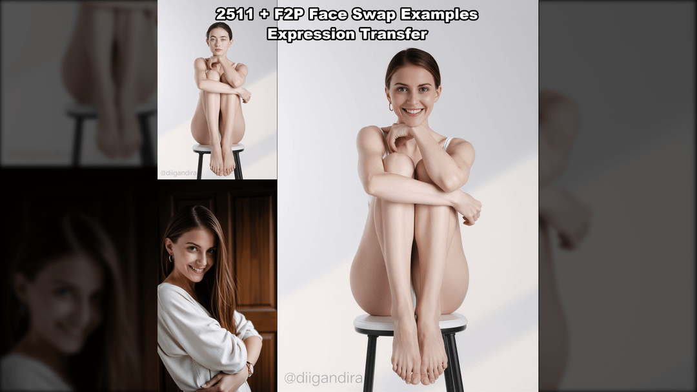

# Face Swap & Image-to-Video Knowledge Base

Eine Sammlung von Anleitungen und Workflows für Face Swap und Image-to-Video mit ComfyUI.

## Enthaltene Guides

| Guide | Beschreibung |
|-------|--------------|
| [Qwen Image Edit 2511 Face Swap](Qwen-Image-Edit-2511-FaceSwap-Guide.md) | Komplette Anleitung für Face Swap mit F2P LoRA |
| [Image-to-Video WAN 2.2](Image-to-Video-WAN22-Workflow.md) | 3-Stufen Workflow: SDXL → Flux → WAN 2.2 |

---

## Quick Start

### Face Swap Pipeline
```
Quellgesicht + Zielbild
        ↓
  Qwen Edit 2511 + F2P LoRA
        ↓
   Face Swap Ergebnis
        ↓
    WAN 2.2 Animation (optional)
        ↓
     Finales Video
```

### Benötigte Hardware
| Workflow | Minimum VRAM | Empfohlen |
|----------|--------------|-----------|
| Face Swap (GGUF) | 12GB | 16GB+ |
| Image-to-Video | 4GB | 12GB+ |
| Advanced WAN 2.2 14B | 16GB | 24GB+ |

---

## Wichtige Ressourcen

### Face Swap Workflows

| Ressource | Link | Beschreibung |
|-----------|------|--------------|
| **F2P LoRA (offiziell)** | [ModelScope](https://modelscope.cn/models/DiffSynth-Studio/Qwen-Image-Edit-F2P) | Face-to-Portrait LoRA |
| **Rapid-AIO Model** | [HuggingFace](https://huggingface.co/Phr00t/Qwen-Image-Edit-Rapid-AIO) | All-in-One mit Versionen V14-V18 |
| **Qwen 2511 GGUF** | [HuggingFace](https://huggingface.co/unsloth/Qwen-Image-Edit-2511-GGUF) | Für Low VRAM |
| **FaboroHacks Tutorial** | [YouTube](https://youtu.be/_QYBgeII9Pg) | Video Walkthrough |

### CivitAI Workflows

| Workflow | Link | Features |
|----------|------|----------|
| **Qwen 2511 Comprehensive** | [CivitAI](https://civitai.com/models/2257780/qwen-image-edit-2511-comprehensive-image-editing-workflow) | Instruction-based editing, 4-8 Steps mit Lightning |
| **Qwen 2509 Head Swap** | [CivitAI](https://civitai.com/articles/20190/headface-swap-workflow-qwen-image-edit-2509) | BFS LoRA Serie, Mask Control |
| **Beginner Head Swap** | [CivitAI](https://civitai.com/models/2087676/comfyui-beginner-friendly-qwen-image-edit-plus-2509-simple-head-swap-gguf-workflow-by-sarcastic-tofu) | Einfacher Einstieg, GGUF |
| **No-LoRA Head Swap** | [CivitAI](https://civitai.com/models/2170880/comfyui-qwen-edit-workflow-for-head-swap-no-loras-needed) | Ohne Custom LoRA, Production-ready |
| **Pixel-Perfect Swap** | [CivitAI](https://civitai.com/models/2045000/qwen-edit-face-swap-head-swap-anything-swap-workflow) | Red Mask Trick |

### Image-to-Video Workflows

| Workflow | Link | Features |
|----------|------|----------|
| **Full I2V Walkthrough** | [CivitAI](https://civitai.com/articles/24175/full-image-to-video-workflow-walkthrough) | 3-Stage, 4GB VRAM möglich |
| **WAN 2.2 + Face Enhancement** | [CivitAI](https://civitai.com/models/1964239/advanced-wan22-fun-vace-4-steps-video-generation-with-face-enhancement-and-outpainting) | 14B Model, 6+ LoRAs, Face Enhancement |
| **Step-by-Step WAN 2.2** | [CivitAI](https://civitai.com/articles/18271/step-by-step-guide-series-comfyui-wan-22-img-to-video) | Beginner Guide |
| **Simple WAN 2.2 I2V** | [CivitAI](https://civitai.com/models/1824577/img-to-video-simple-workflow-wan22-or-gguf-or-lora-or-upscale-or-fast) | GGUF, LoRA, Upscale |
| **WAN 2.2 MultiClip** | [CivitAI](https://civitai.com/models/1823416/wan-22-image-to-video-with-caption-and-postprocessing) | Caption + Postprocessing |

---

## Model Übersicht

### Face Swap Models
```
ComfyUI/models/
├── diffusion_models/
│   └── qwen_image_edit_2511_fp8mixed.safetensors
├── unet/
│   └── qwen-image-edit-2511-Q4_0.gguf
├── text_encoders/
│   └── qwen_2.5_vl_7b_fp8_scaled.safetensors
├── vae/
│   └── qwen_image_vae.safetensors
└── loras/
    ├── Qwen-Image-Edit-2511-Lightning-4steps-V1.0.safetensors
    ├── consistency_edit_v2.safetensors
    └── Qwen-Image-Edit-F2P.safetensors
```

### Image-to-Video Models (WAN 2.2)
```
ComfyUI/models/
├── diffusion_models/
│   ├── wan2.2_i2v_high_noise_14B_fp8_scaled.safetensors
│   └── wan2.2_i2v_low_noise_14B_fp8_scaled.safetensors
├── clip/
│   └── umt5_xxl_fp8_e4m3fn_scaled.safetensors
└── vae/
    └── wan_2.1_vae.safetensors
```

---

## Empfohlene Einstellungen

### Face Swap (Qwen 2511 + F2P)
| Parameter | Wert |
|-----------|------|
| F2P LoRA Strength | 0.80 |
| Lightning LoRA | 1.00 |
| Consistency LoRA | 0.75 |
| Scheduler | euler_ancestral/beta |
| CFG | 4.0 |
| Steps | 20 (oder 4 mit Lightning) |

### Image-to-Video (WAN 2.2)
| Parameter | Wert |
|-----------|------|
| Steps | 6 |
| CFG | 1 |
| Sampler | Euler |
| Scheduler | Simple |
| Shift | 8-11 |
| Frames | 100 (~6 Sek) |

---

## Tipps

1. **Plastik-Look vermeiden**: F2P Strength auf 0.80 halten, V17/V18 Rapid-AIO verwenden
2. **Prompt ist wichtig**: "The prompt matters a lot over the final result"
3. **MaskGrow**: grow=30, blur=20 für weiche Übergänge
4. **Low VRAM**: GGUF Modelle verwenden
5. **Workflow testen**: Erst auf [RunningHub](https://runninghub.ai) testen, dann lokal

---

## Beispielbilder


*Face Swap mit Qwen 2511 + F2P LoRA*

---

## Links

- [ComfyUI](https://github.com/comfyanonymous/ComfyUI)
- [ComfyUI Manager](https://github.com/ltdrdata/ComfyUI-Manager)
- [RunningHub](https://runninghub.ai) - Workflows online testen
- [CivitAI](https://civitai.com) - Modelle und Workflows
- [HuggingFace](https://huggingface.co) - Model Downloads

---

## Lizenz

Dieses Repository enthält nur Dokumentation und Beispielbilder. Die referenzierten Modelle und Workflows unterliegen ihren jeweiligen Lizenzen.
